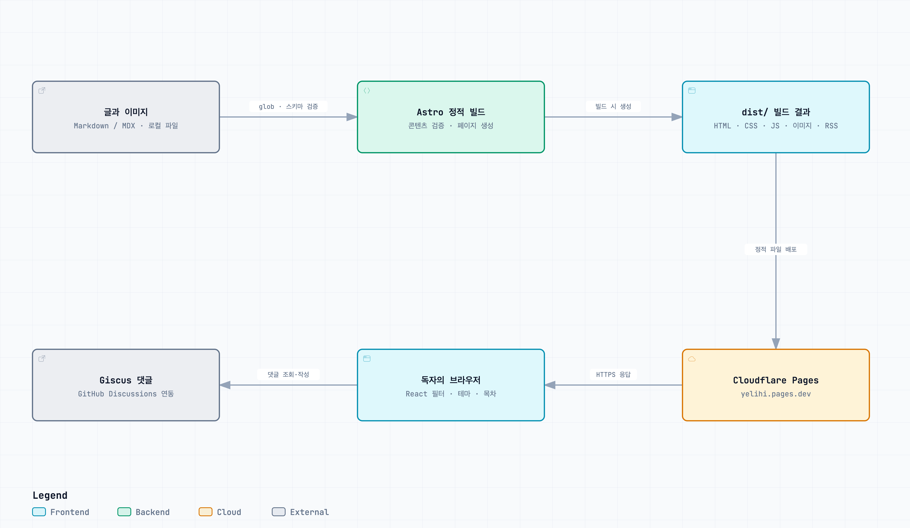

# Yelihi의 블로그

개발 과정에서 배운 지식과 문제 해결 경험, 일상 속 생각을 기록하는 개인 블로그입니다. 티스토리에서 이전하여 Astro 기반으로 직접 만들고, Cloudflare Pages로 배포하고 있습니다.

**블로그 바로가기: [yelihi.pages.dev](https://yelihi.pages.dev/)**

Astro, React, TypeScript, Tailwind CSS를 사용하며, 글은 Markdown/MDX로 작성합니다. 블로그 소스 코드는 `astro-base/`에 있습니다.

## 아키텍처

Astro의 정적 사이트 생성(SSG)을 중심으로 구성되어 있습니다. 글을 읽는 요청마다 서버에서 페이지를 만들지 않고, 빌드 시 생성한 파일을 Cloudflare Pages에서 제공합니다. 별도 애플리케이션 서버나 자체 데이터베이스는 없으며, 상호작용이 필요한 부분에 React를 사용합니다.

[인터랙티브 다이어그램 열기](https://yelihi.pages.dev/architecture) · [PNG 이미지](https://yelihi.pages.dev/architecture.png) · [다이어그램 원본](docs/architecture.json)

이미지를 클릭하면 배포된 Archify 뷰어가 열립니다. 확대와 구성 요소별 코드 근거 탐색이 가능하며, 오른쪽 위 **Export**에서 PNG·SVG 등으로 내려받을 수 있습니다. 다이어그램 본문은 한국어이며, 뷰어의 기본 UI와 HTML 문서 언어는 영어입니다.

### 구성과 역할

| 영역 | 역할 | 주요 코드 |
| --- | --- | --- |
| 콘텐츠 | `src/content/articles/`의 Markdown/MDX를 읽고 Zod 스키마로 메타데이터 검증 | [content.config.ts](astro-base/src/content.config.ts) |
| 페이지 생성 | 홈·글 목록·소개 페이지와 `getStaticPaths()` 기반 글 상세 페이지 생성 | [pages/](astro-base/src/pages/), [글 상세](astro-base/src/pages/articles/%5B...slug%5D.astro) |
| 공통 화면 | 레이아웃·메타 태그·헤더·푸터 구성, Tailwind CSS 적용 | [Default.astro](astro-base/src/layouts/Default.astro), [BaseHead.astro](astro-base/src/components/BaseHead.astro) |
| 브라우저 상호작용 | 글 목록의 카테고리 필터, 테마 전환, 목차와 애니메이션 | [React 컴포넌트](astro-base/src/components/react/) |
| 이미지·본문 처리 | Sharp 기반 표지 이미지 WebP 변환, Shiki 코드 강조, Mermaid 렌더링 | [transferImagesFormat.ts](astro-base/src/composables/transferImagesFormat.ts), [astro.config.mjs](astro-base/astro.config.mjs) |
| 댓글 | `@giscus/react`로 GitHub Discussions의 `blog comments` 카테고리와 연결, 페이지 경로로 글 구분 | [GiscusContainer.tsx](astro-base/src/components/react/GiscusContainer.tsx) |
| 배포 | `astro-base/dist/`의 정적 결과물을 Cloudflare Pages에서 제공 | [package.json](astro-base/package.json), [운영 블로그](https://yelihi.pages.dev/) |

### 실행 흐름

1. **글 작성과 빌드:** 글과 이미지를 저장소에 추가한 뒤 `astro-base/`에서 `npm run build`를 실행합니다. 이 명령은 Chromium 설치 후 Astro 빌드를 수행합니다. 콘텐츠 컬렉션을 읽어 페이지, 최적화 이미지, RSS와 사이트맵을 생성하므로 글 변경은 재빌드·배포 후 반영됩니다.
2. **페이지 열기:** 브라우저가 정적 HTML과 필요한 자산을 받습니다. `client:load`는 헤더와 글 목록, `client:visible`은 홈의 글 카드, `client:media`는 데스크톱 목차의 React 실행 시점을 지정합니다. 댓글은 `client:only="react"`로 브라우저에서 렌더링합니다.
3. **필터와 댓글:** 카테고리 필터는 빌드 시 전달한 `initialArticles`를 React 상태로 필터링합니다. 댓글 조회·작성은 Giscus가 담당하며, 블로그 자체 API 서버를 거치지 않습니다.

### 현재 구현에서 참고할 점

- `output: 'static'`이며 Cloudflare 어댑터는 주석 처리되어 있습니다. 현재 구조에 Cloudflare Workers 기반 SSR은 포함되지 않습니다.
- [articles.json.ts](astro-base/src/pages/api/articles.json.ts)는 정적 JSON 엔드포인트이지만 현재 글 목록 UI에서는 호출하지 않습니다. 동적 카테고리 API로 사용되는 구조가 아닙니다.
- `astro.config.mjs`의 `site`가 아직 `https://example.com`입니다. canonical URL, RSS와 사이트맵의 기준 주소를 운영 주소와 맞추는 후속 정리가 필요합니다.

분석은 현재 저장소 코드와 앞서 확인한 Cloudflare Pages 배포 기록을 기준으로 했습니다. Cloudflare 대시보드의 빌드 설정은 저장소에 포함되어 있지 않습니다.
