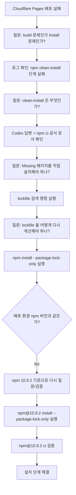
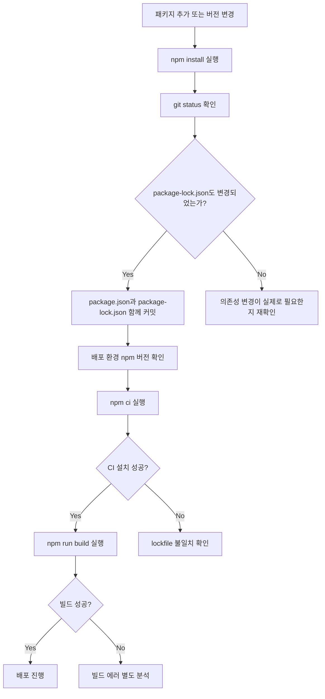

## npm 'clean' install?

블로그를 배포하는 과정에서 build 가 막혔다.

처음에는 당연히 애플리케이션 코드 문제라고 생각했다. Astro 설정이 잘못되었거나, Cloudflare adapter 쪽에서 뭔가 맞지 않았거나, 최근 추가한 패키지 중 하나가 build 단계에서 문제를 일으킨 것이라 생각했다.

그런데 배포 로그를 다시 보니 상황이 조금 달랐다.

애플리케이션 코드가 build 되기도 전에 멈추고 있었다.
정확하게는 의존성 설치 단계에서 실패했다.

Cloudflare Pages 로그에는 다음 명령이 보였다.

```bash
npm clean-install --progress=false
```

그리고 핵심 에러는 다음이었다.

```bash
npm ci can only install packages when your package.json and package-lock.json are in sync.
Please update your lock file with npm install before continuing.
```

이 지점에서 바로 코드를 고치는 것이 아니라, 우선 질문을 던졌다.

> `npm clean-install` 이 정확히 무엇이고, 왜 `package.json` 과 `package-lock.json` 이 맞지 않으면 배포가 멈추는가?

이 질문을 Codex 에게 먼저 던졌고, 답변을 바탕으로 공식 문서를 다시 확인했다.
확인한 문서는 다음과 같다.

- [npm ci 공식 문서](https://docs.npmjs.com/cli/v10/commands/npm-ci/)
- [npm install 공식 문서](https://docs.npmjs.com/cli/v10/commands/npm-install/)
- [package-lock.json 공식 문서](https://docs.npmjs.com/cli/v10/configuring-npm/package-lock-json/)
- [Cloudflare Pages build configuration 문서](https://developers.cloudflare.com/pages/configuration/build-configuration/)

공식 문서를 보면서 알게 된 것은 `npm clean-install` 이 별도의 낯선 명령이라기보다는 `npm ci` 의 alias 라는 점이었다.
그리고 `npm ci` 는 CI/CD 환경에서 재현 가능한 설치를 위해 사용되는 명령이고, `package.json` 과 lockfile 이 맞지 않으면 lockfile 을 자동으로 고치지 않고 실패한다.

즉, 이번 문제는 build 에러가 아니라 **build 이전의 clean install 단계에서 lockfile 검증에 실패한 문제**였다.

## 첫 번째 질문: 무엇이 누락되었다는 것인가

배포 로그에는 다음 메시지도 같이 있었다.

```bash
Missing: @emnapi/core@1.11.1 from lock file
Missing: @emnapi/runtime@1.11.1 from lock file
Missing: esbuild@0.28.1 from lock file
Missing: esbuild@0.28.1 from lock file
```

처음에는 이 패키지들을 직접 설치해야 하나 싶었다.
그래서 다시 질문했다.

> `Missing from lock file` 이라면 해당 패키지를 직접 `package.json` 에 추가해야 하는가?

Codex 의 답변은 바로 직접 설치하기보다는 먼저 lockfile 을 확인하라는 쪽이었다.
특히 `esbuild`, `@emnapi/core`, `@emnapi/runtime` 같은 패키지는 직접 의존성이 아니라 하위 의존성일 수 있다고 했다.

이 설명이 맞는지 확인하기 위해 먼저 실제 파일에서 참조 상태를 검색했다.

```bash
rg -n '(@emnapi/core|@emnapi/runtime|esbuild)' package-lock.json package.json
```

이 명령은 직접 설치 여부를 확인하려는 것이 아니라, 현재 `package.json` 과 `package-lock.json` 에 관련 패키지가 어떤 형태로 나타나는지 확인하기 위한 것이었다.

확인 결과 관련 참조는 있었지만, npm 이 기대하는 정확한 lockfile 엔트리가 충분하지 않은 상태로 보였다.

여기서 다시 Codex 에게 물었다.

> 참조는 있는데 `Missing from lock file` 이 계속 나온다면, 직접 패키지를 추가하는 것이 맞는가 아니면 lockfile 을 다시 계산하는 것이 맞는가?

Codex 는 이 경우 직접 의존성을 늘리는 것보다, 현재 `package.json` 을 기준으로 lockfile 을 다시 계산하는 쪽이 먼저라고 답했다.
그래서 바로 패키지를 추가하지 않고, lockfile 재계산 방향으로 진행했다.

여기서 판단은 다음과 같았다.

```text
직접 의존성을 추가해야 하는 문제가 아니라,
이미 선언된 의존성 기준으로 package-lock.json 을 다시 계산해야 하는 문제일 가능성이 높다.
```

## package.json 과 package-lock.json 은 무엇이 다른가

이 지점에서 다시 질문을 던졌다.

> `package.json` 과 `package-lock.json` 은 각각 어떤 역할을 하고, 왜 둘이 맞지 않으면 `npm ci` 가 실패하는가?

공식 문서와 Codex 답변을 같이 보면서 정리하면 다음과 같다.

`package.json` 은 프로젝트가 어떤 패키지를 필요로 하는지 선언하는 파일이다.

예를 들면 다음과 같다.

```json
{
  "dependencies": {
    "astro": "^7.0.3",
    "@astrojs/cloudflare": "^14.0.1",
    "@astrojs/react": "^6.0.0"
  }
}
```

여기서 `^7.0.3` 은 정확히 7.0.3만 설치하라는 뜻이 아니다.
호환 가능한 범위 안에서 설치해도 된다는 의미다.

즉, `package.json` 은 실제 설치 결과라기보다는 **프로젝트가 요구하는 의존성 범위**에 가깝다.

반대로 `package-lock.json` 은 npm 이 실제로 계산한 설치 결과다.
직접 설치한 패키지뿐 아니라, 그 패키지들이 내부적으로 필요로 하는 하위 의존성까지 모두 기록된다.

정리하면 다음과 같다.

| 파일 | 역할 | 성격 |
|---|---|---|
| `package.json` | 필요한 의존성 범위 선언 | 비교적 유연함 |
| `package-lock.json` | 실제 설치될 의존성 트리 고정 | 엄격함 |
| `node_modules` | 실제 설치된 패키지 파일 | 로컬 실행 결과 |

조금 더 풀어보면 이런 차이다.

```text
package.json:
  astro는 ^7.0.3 범위 안에서 설치해줘.

package-lock.json:
  실제로는 astro 7.0.3을 설치했고,
  그 하위 의존성으로 A, B, C를 설치했고,
  esbuild는 0.28.1이며,
  다운로드 무결성 해시는 이것이다.
```

결국 CI 환경에서는 `package-lock.json` 이 기준이 된다.
CI 가 매번 새로운 의존성 트리를 계산해버리면 로컬과 배포 환경의 결과가 달라질 수 있기 때문이다.

## 두 번째 질문: npm install 과 npm ci 는 무엇이 다른가

다음 질문은 자연스럽게 이어졌다.

> 그렇다면 왜 로컬에서는 `npm install` 을 쓰고, 배포 환경에서는 `npm ci` 를 쓰는가?

이 부분도 [npm ci 문서](https://docs.npmjs.com/cli/v10/commands/npm-ci/)와 [npm install 문서](https://docs.npmjs.com/cli/v10/commands/npm-install/)를 같이 확인했다.

정리하면 다음과 같다.

| 명령어 | 주 사용 위치 | lockfile 수정 | 특징 |
|---|---|---:|---|
| `npm install` | 로컬 개발 환경 | 수정 가능 | 의존성 트리를 다시 계산하고 lockfile 을 갱신할 수 있음 |
| `npm ci` | CI/CD 환경 | 수정하지 않음 | lockfile 과 `package.json` 이 맞지 않으면 실패 |
| `npm clean-install` | `npm ci` alias | 수정하지 않음 | Cloudflare Pages 로그에서 표시됨 |

`npm install` 은 개발 중에 쓰기 좋다.
패키지를 추가하거나 버전을 올리면 `package.json` 과 `package-lock.json` 을 같이 갱신할 수 있다.

반대로 `npm ci` 는 배포 환경에 더 적합하다.
lockfile 에 기록된 그대로 설치할 수 있는지 확인하고, 문제가 있으면 lockfile 을 자동 수정하지 않는다.

그래서 이번 에러 메시지가 나온 것이다.

```text
package.json 과 package-lock.json 이 sync 되어 있지 않다.
CI 환경에서는 lockfile 을 자동으로 고치지 않는다.
따라서 설치를 중단한다.
```

## 질문과 실행을 반복한 과정

이번 문제를 해결한 과정은 대략 다음 흐름이었다.



이 과정에서 중요한 것은 명령어를 바로 실행한 것이 아니라, 매 단계마다 질문을 먼저 했다는 점이다.

- 이 에러가 build 에러인지 install 에러인지 질문
- `clean-install` 이 무엇인지 질문
- missing dependency 를 직접 설치해야 하는지 질문
- `package-lock.json` 만 다시 계산해도 되는지 질문
- 배포 환경 npm 버전과 로컬 npm 버전 차이가 문제될 수 있는지 질문
- 어떤 명령으로 검증해야 하는지 질문

Codex 는 이 질문들에 대해 가능한 방향을 제시해주었고, 나는 그 답을 그대로 믿기보다는 공식 문서와 실제 명령어 실행으로 확인했다.
이 방식이 꽤 중요했다.

AI 답변은 방향을 잡는 데 유용했지만, 최종 판단은 로그와 공식 문서, 그리고 실제 명령 실행 결과로 해야 했다.

## 첫 번째 실행: lockfile 만 다시 계산하기

먼저 일반 npm 으로 lockfile 만 다시 계산했다.

```bash
npm install --package-lock-only --ignore-scripts
```

각 옵션의 의미는 다음과 같다.

| 옵션 | 의미 |
|---|---|
| `--package-lock-only` | `node_modules` 설치보다 `package-lock.json` 재계산에 집중 |
| `--ignore-scripts` | `postinstall` 같은 설치 스크립트를 실행하지 않음 |

이후 npm 11 기준으로는 `npm ci` 가 통과했다.

그렇다면 해결된 것일까?

처음에는 그렇게 생각할 수 있었다.
하지만 다시 배포 로그를 확인해보니 Cloudflare Pages 환경은 다음 버전을 사용하고 있었다.

```text
nodejs@22.16.0
npm@10.9.2
```

여기서 다시 질문했다.

> npm 11 에서 통과한 lockfile 이 npm 10.9.2 에서도 동일하게 통과한다고 볼 수 있는가?

이 부분도 Codex 에게 먼저 물어봤다.
Codex 는 npm 메이저 버전 차이로 lockfile 해석이나 peer dependency, optional dependency 처리 차이가 있을 수 있다고 했다.
그래서 npm 공식 문서의 `npm ci` 설명을 다시 확인했고, lockfile 을 만든 npm 설정과 `npm ci` 실행 조건이 맞지 않으면 에러가 날 수 있다는 점도 같이 확인했다.
그래서 배포 환경과 같은 npm 버전으로 다시 검증하기로 했다.

## 두 번째 실행: Cloudflare Pages 와 같은 npm 버전으로 검증하기

Cloudflare Pages 와 같은 npm 버전으로 `ci` 를 실행했다.

```bash
npx --yes npm@10.9.2 ci --progress=false --cache /tmp/npm10-cache-astro-base
```

결과는 다시 실패였다.

```bash
Missing: @emnapi/core@1.11.1 from lock file
Missing: @emnapi/runtime@1.11.1 from lock file
Missing: esbuild@0.28.1 from lock file
```

이 지점이 핵심이었다.

npm 11 기준으로는 통과한 lockfile 이 npm 10.9.2 기준에서는 여전히 충분하지 않았다.
따라서 실제 배포 환경과 같은 npm 버전으로 lockfile 을 다시 생성해야 했다.

여기서도 바로 명령을 실행하기보다는 다시 Codex 에게 질문했다.

> npm 10.9.2 기준으로 lockfile 만 다시 계산하고, 실제 설치 검증까지 하려면 어떤 순서로 명령을 실행해야 하는가?

답변을 통해 `npx` 로 npm 버전을 고정해 실행하는 방향을 잡았고, 이후 명령어를 실제로 실행해 검증했다.

## 세 번째 실행: npm 10.9.2 기준 lockfile 재생성

정리하면 이때의 질문은 다음과 같았다.

> 배포 환경 npm 버전에 맞춰 lockfile 만 다시 계산하려면 어떤 명령을 써야 하는가?

결론은 `npx` 로 npm 10.9.2 를 지정해서 `install --package-lock-only` 를 실행하는 것이었다.

```bash
npx --yes npm@10.9.2 install --package-lock-only --ignore-scripts --cache /tmp/npm10-cache-astro-base
```

그 다음 같은 npm 버전으로 다시 `ci` 를 실행했다.

```bash
npx --yes npm@10.9.2 ci --progress=false --cache /tmp/npm10-cache-astro-base
```

결과는 성공이었다.

```bash
added 799 packages, and audited 800 packages in 14s
```

이제야 Cloudflare Pages 에서 실패하던 의존성 설치 단계가 해결되었다고 볼 수 있었다.

## 실제로 바뀐 파일은 package-lock.json 하나였다

최종적으로 수정된 파일은 하나였다.

```text
package-lock.json
```

변경량은 다음과 같았다.

```bash
1 file changed, 286 insertions(+), 48 deletions(-)
```

주요 변경 성격은 다음과 같았다.

- npm 10 이 요구하는 optional dependency 엔트리 추가
- `esbuild@0.28.1` 관련 lockfile 엔트리 보강
- `@emnapi/core`, `@emnapi/runtime` 관련 하위 의존성 엔트리 보강
- 일부 패키지에 `peer: true` 같은 lockfile 메타데이터 반영

커밋은 다음으로 생성했다.

```bash
fa761bf Sync package lock for npm ci
```

그리고 `origin/main` 으로 푸시했다.

`package.json` 을 건드리지 않은 이유는 명확하다.
필요한 의존성 선언은 이미 `package.json` 에 있었다.
문제는 그 선언을 기준으로 npm 이 계산한 실제 설치 트리가 `package-lock.json` 에 충분히 반영되지 않은 것이었다.

```text
package.json:
  필요한 의존성 선언은 이미 존재함

package-lock.json:
  해당 선언에 맞는 정확한 의존성 트리가 일부 누락됨

해결:
  package-lock.json 만 배포 환경 npm 기준으로 재계산
```

## build 에서 나온 다른 에러는 분리해서 봐야 한다

추가로 `npx astro build` 도 실행해봤지만, 이 단계에서는 다른 이유로 실패했다.

대표적으로 다음 에러가 있었다.

```bash
Could not fetch from https://api.fontsource.org/v1/fonts
getaddrinfo ENOTFOUND api.fontsource.org
```

그리고 다음 에러도 있었다.

```bash
browserType.launch: Target page, context or browser has been closed
Permission denied
```

첫 번째는 현재 로컬 샌드박스에서 Fontsource API 에 접근하지 못한 DNS/network 문제였다.
두 번째는 Playwright Chromium 이 로컬 샌드박스 권한 때문에 실행되지 못한 문제였다.

중요한 것은 이 문제들이 Cloudflare Pages 배포 로그에서 처음 막힌 원인과는 다르다는 점이다.

처음 실패한 단계는 build 가 아니라 의존성 설치였다.
따라서 이번 수정에서 핵심 검증 명령은 다음이었다.

```bash
npx --yes npm@10.9.2 ci --progress=false --cache /tmp/npm10-cache-astro-base
```

이 명령이 성공했으므로, 적어도 Cloudflare Pages 에서 막히던 `npm clean-install` 문제는 해결된 것으로 볼 수 있었다.

## 앞으로는 어떻게 확인할까

의존성을 바꿨다면 `package.json` 과 `package-lock.json` 을 같이 봐야 한다.

예를 들어 패키지를 추가하거나 버전을 올렸다면 다음처럼 확인한다.

```bash
npm install some-package
git status
```

보통은 두 파일이 함께 변경된다.

```bash
M package.json
M package-lock.json
```

이 경우 둘 다 커밋해야 한다.

그리고 배포 전에 최소한 다음 두 명령을 확인하면 좋다.

```bash
npm ci
npm run build
```

다만 이번처럼 배포 환경의 npm 버전이 명확하다면, 그 버전에 맞춰 검증하는 것이 더 정확하다.

```bash
npx --yes npm@10.9.2 ci --progress=false
```

흐름을 정리하면 다음과 같다.



## 정리하자면

이번 문제는 혼자 로그만 보면서 바로 해결한 문제는 아니었다.

배포 로그를 보고 질문을 던지고, Codex 에게 가능한 원인을 물어보고, npm 공식 문서와 Cloudflare 문서를 확인하고, 그 다음 실제 명령어를 실행했다.
그리고 한 번에 해결된 것이 아니라 npm 11 기준 성공 이후 npm 10.9.2 기준 실패를 다시 확인했고, 배포 환경과 같은 npm 버전으로 lockfile 을 재생성하면서 해결되었다.

이 과정을 통해 느낀 점은 명확하다.

AI 는 원인을 좁히고 다음 명령어 후보를 찾는 데 꽤 도움이 된다.
하지만 최종 확인은 결국 공식 문서와 실제 실행 결과로 해야 한다.

특히 배포 문제는 로컬에서 한 번 성공했다고 끝내면 안 된다.
배포 환경이 어떤 Node/npm 버전을 쓰는지, 어떤 명령어를 실행하는지, 그 명령이 어떤 전제를 요구하는지까지 맞춰봐야 한다.

이번 일은 `npm ci` 가 왜 clean install 인지 이해하는 계기가 되었다.
`npm ci` 는 적당히 맞춰 설치해주는 명령이 아니라, lockfile 에 고정된 그대로 설치할 수 있는지를 엄격하게 확인하는 명령이다.

그리고 그 엄격함을 통과하려면, `package.json` 과 `package-lock.json` 의 관계를 개발자가 직접 관리해야 한다.
이번 배포 실패는 그 부분을 다시 확인하게 해준 사건이었다.
