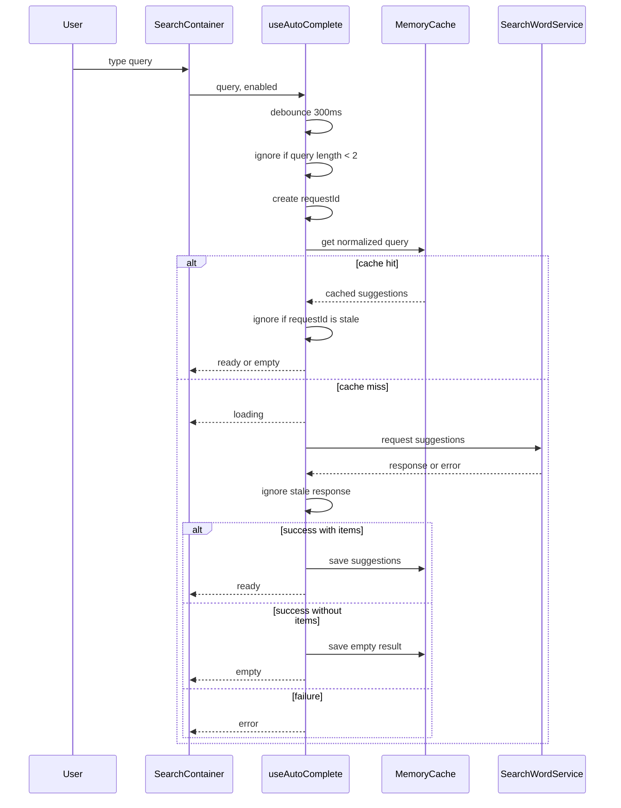

## RADIO 설계 방식

하나의 컴포넌트라도 역할에 따라서는 생각보다 더 상세한 설계가 필요할 때가 있다.
특히 프론트엔드에서는 단순히 데이터 모델만 맞춘다고 끝나지 않는다. 사용자가 실제로 마주하는 View, 그 View 안에서 바뀌는 State, 그리고 입력과 비동기 요청이 엮이는 흐름까지 같이 봐야 한다.

검색어 자동 추천 컴포넌트가 딱 그렇다.

겉으로 보기에는 input 하나와 dropdown 하나면 끝날 것 같지만, 실제로는 입력 지연, 요청 중복, race condition, keyboard navigation, mouse hover, loading, empty, error, cache 같은 것들이 같이 따라온다. 이런 부분을 제대로 보지 않고 “검색어 추천 기능” 정도로만 설계하면 구현 중간에 계속 예외가 튀어나올 가능성이 높다.

이번 글에서는 실제 요구사항과 구조, 데이터 모델, 인터페이스, 성능 지표를 같이 보면서 **RADIO** 방식으로 검색어 자동 추천 컴포넌트를 설계해보려고 한다.

- R: Requirement
- A: Architecture
- D: Data Model
- I: Interface
- O: Optimization

## R: Requirement

요구사항은 특정 페이지, 컴포넌트, 비즈니스 로직이 실제로 무엇을 해야 하는지 정의하는 단계다.

개인적으로는 이 단계가 가장 중요하다고 생각한다. 요구사항만 잘 파악하고 적절하게 나눠도 이후 구조는 어느 정도 자연스럽게 따라온다. 특히 AI를 활용해서 구현까지 이어가려면 요구사항은 사실상 명세서 역할을 하게 된다. 이 명세가 애매하면 이후 프롬프트도, 테스트도, 구현도 같이 흔들릴 수밖에 없다.

요구사항을 정리하는 과정에서는 처음부터 도메인 주도 설계, 상태관리 라이브러리, 폴더 구조 같은 개발론을 끌어올 필요는 없다고 본다. 먼저 사용자 입장과 서비스를 제공하는 회사 입장에서 무엇이 필요한지 적는 것이 좋다. 개발적인 판단은 그 다음 단계에서 붙여도 늦지 않다.

이번 예제로 삼을 **추천어 자동완성 input component**의 요구사항은 다음과 같이 잡을 수 있겠다.

| 구분 | 요구사항 |
| --- | --- |
| 입력 | 사용자가 텍스트를 입력하면 input 아래에 추천 검색어 목록이 노출된다. |
| 노출 조건 | 검색어 추천은 2글자 이상부터 나타난다. |
| 선택 | 사용자가 추천어를 클릭하면 해당 검색어가 선택된다. 현재 구현 범위에서는 검색어 state를 선택된 값으로 바꾸는 것까지로 둔다. |
| 스크롤 | 추천 검색어 목록은 스크롤 가능해야 한다. |
| 강조 | 추천어에서 입력한 검색어와 겹치는 부분은 굵게 표시한다. |
| 포커스 | 마우스 hover와 키보드 focus 시 배경색이 변경된다. |
| 키보드 | 화살표 위/아래로 추천어를 이동하고, enter 입력 시 선택한다. |
| 요청 상태 | 추천어를 가져오는 중에는 loading 화면이 필요하다. |
| 예외 상태 | 추천어를 가져오지 못하거나 검색 결과가 없을 때의 화면도 필요하다. |

위 요구사항을 보면 비즈니스 규칙도 있고 UI 규칙도 있다. 여기에 비기능적인 요구사항도 같이 붙는다.

- 추천어는 빠르게 보여야 한다.
- API 호출을 과도하게 보내면 안 된다.
- 느린 네트워크에서도 검색창 자체는 사용할 수 있어야 한다.
- 모바일과 데스크톱을 모두 지원해야 한다.
- 키보드 접근성이 필요하다.
- API 실패 시에도 input 사용은 막히면 안 된다.

여기서 “빠르게”, “과도하게”, “느린 네트워크” 같은 표현은 설계 단계에서 수치로 바꾸는 것이 좋다. 예를 들면 이렇게 바꿀 수 있다.

- debounce delay는 300ms로 둔다.
- query는 trim 후 2글자 이상일 때만 요청한다.
- 같은 query는 cache hit 시 API를 다시 호출하지 않는다.
- 이전 요청보다 나중 요청의 결과만 화면에 반영한다.
- error 상태에서도 input value 변경은 가능해야 한다.

이 정도까지 요구사항이 정리되면, 이제 실제 구조를 잡을 수 있다.

## A: Architecture

요구사항을 기반으로 설계를 진행할 때는 개발적인 요소를 고려해야 한다.
layer 구조, 폴더 구조, 실행 흐름, 필요한 오픈소스 여부, 비동기 요청의 실패 지점 같은 것들이 이 단계에서 정리된다.

먼저 검색어 추천은 **비동기 서버 요청**이다. 이 하나만으로도 꽤 많은 고려사항이 생긴다.

- 과도한 호출을 막기 위해 debounce가 필요하다.
- race condition을 막기 위해 가장 마지막 요청의 결과만 반영해야 한다.
- 같은 query를 계속 호출하는 것은 낭비이므로 client cache가 필요하다.
- cache key는 normalize된 query를 사용해야 한다.
- 요청 상태와 dropdown 상태를 분리해서 표현해야 한다.

> 비동기 요청이라는 사실 하나만으로도 사용자가 겪을 수 있는 애로사항이 꽤 많이 생긴다. 설계 단계에서 이 부분을 놓치면 구현 후반에 예외 처리가 계속 늘어난다.

검색어 요청은 UI 입력 흐름과 분리하는 것이 좋다.

- input은 `query`를 관리한다.
- debounce 이후 요청 실행은 hook 또는 service에 위임한다.
- 응답 DTO는 UI에서 바로 쓰지 않고 `RecommendWord` 같은 UI 모델로 변환한다.
- input은 controlled component로 둔다.

이렇게 분리하는 이유는 단순하다. service 함수가 UI state까지 직접 건드리면 이후 유지보수도 어려워지고, 테스트를 작성하거나 AI를 통해 구현을 이어갈 때도 경계가 흐려진다. UI layer가 책임질 것은 UI layer 안에 두고, 요청과 cache는 별도 경계에 두는 편이 낫다.

dropdown 상태는 요청 상태와 결과 상태를 함께 표현해야 한다.

```ts
type AutoCompleteStatus = 'idle' | 'loading' | 'ready' | 'empty' | 'error';
```

각 상태는 다음처럼 해석할 수 있다.

| 상태 | 의미 |
| --- | --- |
| `idle` | query가 비어 있거나 2글자 미만이라 요청하지 않는 상태 |
| `loading` | 추천어 요청이 진행 중인 상태 |
| `ready` | 추천 결과가 존재하는 상태 |
| `empty` | 요청은 성공했지만 결과가 없는 상태 |
| `error` | 요청이 실패한 상태 |

focus 상태는 mouse hover와 keyboard navigation이 같은 값을 바라보도록 해야 한다.

- `focusedIndex`를 기준으로 현재 focus된 추천어를 계산한다.
- mouse enter 시 `focusedIndex`를 갱신한다.
- arrow up/down 시 `focusedIndex`를 갱신한다.
- enter 입력 시 현재 `focusedIndex`의 추천어를 선택한다.

선택 이벤트는 검색 이벤트와 다르게 처리하는 것이 좋다.

- 추천어 선택 시 `query`를 선택된 value로 변경한다.
- dropdown을 닫는다.
- 선택으로 인한 query 변경은 다시 debounce 요청을 발생시키지 않는다.

여기서 마지막 조건이 중요하다. 추천어를 선택해서 input value가 바뀌었는데, 그 값으로 다시 추천어 요청이 발생하면 사용자는 이미 선택을 끝냈는데 dropdown이 다시 열리는 이상한 경험을 하게 될 수 있다.

cache는 지금은 memory cache로 시작해도 충분하다.

- 현재 구현은 memory cache로 시작한다.
- cache key는 trim/lowercase 처리한 query를 사용한다.
- TTL을 둬서 너무 오래된 결과는 버린다.
- 이후 필요하다면 Web Worker 기반 cache나 server cache로 옮길 수 있다.

처음부터 복잡한 cache layer를 만들 필요는 없지만, UI와 service 호출부가 cache 구현에 직접 의존하지 않도록 경계는 잡아두는 편이 좋다.

전체 흐름을 Mermaid로 정리하면 다음과 같다.



위 흐름에서 중요한 것은 각 함수가 어디까지 책임지는지다.

- 사용자는 검색창에 검색어를 입력한다.
- debounce로 요청 타이밍을 늦춘다.
- 2글자 이상 조건을 통과하면 requestId를 갱신한다.
- query를 정규화해서 cache key로 사용한다.
- cache hit이면 cached result를 사용한다.
- cache miss이면 server 요청을 보낸다.
- 응답이 오래된 요청이면 버린다.
- 최신 응답만 상태로 반영한다.

이 정도로 흐름이 잡히면 구현 중간에 “이 상태는 어디서 관리해야 하지?” 같은 질문이 줄어든다.

## D: Data Model

Data Model은 처음부터 모든 것을 확정하고 들어가야 하는지는 조금 의문이 있다. 그래도 어느 정도 잡고 가면 이후 interface를 설정할 때 훨씬 명확해지는 장점이 있다.

특히 server state와 client state는 분리해서 봐야 한다.

이번 컴포넌트에서 server state는 추천 검색어 목록이다.

```ts
export interface SearchWordDto {
    id: string;
    value: string;
}

export interface AutoCompleteSearchResponseDto {
    total: number;
    items: SearchWordDto[];
}
```

반면 client state는 UI와 훨씬 밀접하다.

| 상태 | 설명 |
| --- | --- |
| `query` | 사용자가 현재 입력 중인 검색어 |
| `selectedSuggestionValue` | 사용자가 선택한 추천어 값 |
| `status` | dropdown과 요청 상태를 표현하는 값 |
| `isDropdownOpen` | dropdown 표시 여부 |
| `focusedIndex` | hover 또는 keyboard navigation으로 focus된 추천어 위치 |
| `isPending` | 요청 진행 여부 |

여기서 `status`와 `isDropdownOpen`은 비슷해 보이지만 역할이 다르다.

`status`는 데이터 요청과 결과의 상태를 나타낸다. 반면 `isDropdownOpen`은 화면에 dropdown을 보여줄지 말지를 나타낸다. 예를 들어 `ready` 상태라도 사용자가 추천어를 선택했다면 dropdown은 닫혀야 한다. 그래서 둘을 하나로 합치면 오히려 조건이 복잡해질 수 있다.

UI에서 사용할 모델은 DTO와 분리할 수도 있다.

```ts
export interface RecommendWord {
    id: string;
    value: string;
    matchedRanges: Array<{
        start: number;
        end: number;
    }>;
}
```

추천어에서 query와 겹치는 부분을 bold 처리하려면 UI는 단순 문자열뿐 아니라 어느 구간이 매칭되었는지도 알아야 한다. 이 계산을 dropdown 안에서 매번 처리할 수도 있지만, service 응답을 UI model로 변환하는 단계에서 처리하면 dropdown은 렌더링에만 집중할 수 있다.

## I: Interface

구조가 어느 정도 잡혔다면 interface를 작성할 수 있다.

요즘은 이 부분을 AI에게 위임하는 경우도 많지만, 개인적으로는 직접 한 번 써보는 것이 좋다고 생각한다. interface를 직접 작성하면 이후 구현을 읽을 때도 훨씬 덜 흔들린다. 그리고 AI에게 구현을 요청할 때도 “대충 자동완성 컴포넌트 만들어줘”보다 훨씬 안정적인 결과를 기대할 수 있다.

먼저 요청 service와 cache의 경계를 잡아본다.

```ts
export interface SearchWordDto {
    id: string;
    value: string;
}

export interface AutoCompleteSearchResponseDto {
    total: number;
    items: SearchWordDto[];
}

export interface SearchWordService {
    search(query: string): Promise<AutoCompleteSearchResponseDto>;
}

export interface AutoCompleteCache<T> {
    get(key: string): T | null;
    set(key: string, value: T): void;
    delete(key: string): void;
    clear(): void;
}
```

hook의 interface는 다음 정도로 시작할 수 있겠다.

```ts
type AutoCompleteStatus = 'idle' | 'loading' | 'ready' | 'empty' | 'error';

type UseAutoCompleteParams = {
    query: string;
    enabled?: boolean;
};

type UseAutoCompleteReturn = {
    status: AutoCompleteStatus;
    isLoading: boolean;
    suggestions: SearchWordDto[];
    suggestionCount: number;
    error: Error | null;
};

function useAutoComplete(params: UseAutoCompleteParams): UseAutoCompleteReturn;
```

interaction은 요청 hook과 분리하는 편이 낫다.

```ts
type UseAutoCompleteInteractionParams = {
    query: string;
    status: AutoCompleteStatus;
    suggestions: SearchWordDto[];
    onSelect: (value: string) => void;
};

type UseAutoCompleteInteractionReturn = {
    isOpen: boolean;
    open: () => void;
    close: () => void;
    focusedIndex: number;
    setFocusedIndex: (index: number) => void;
    handleMouseEnter: (index: number) => void;
    handleKeyDown: (event: KeyboardEvent<HTMLInputElement>) => void;
    selectWord: (word: SearchWordDto) => void;
};

function useAutoCompleteInteraction(
    params: UseAutoCompleteInteractionParams,
): UseAutoCompleteInteractionReturn;
```

component props는 최대한 단순하게 둔다.

```ts
type AutoCompleteInputProps = {
    value: string;
    onChange: (value: string) => void;
    onFocus: () => void;
    onBlur: (event: FocusEvent<HTMLInputElement>) => void;
    onKeyDown: (event: KeyboardEvent<HTMLInputElement>) => void;
};

type AutoCompleteDropdownProps = {
    query: string;
    status: AutoCompleteStatus;
    suggestions: SearchWordDto[];
    focusedIndex: number;
    onMouseEnter: (index: number) => void;
    onSelect: (word: SearchWordDto) => void;
};
```

구조체를 먼저 잡고 개발에 들어가면 장점이 있다.

- 구현 과정에서 정해진 구조를 준수하기 때문에 실수를 줄일 수 있다.
- 테스트 주도 개발 시 mock 함수를 만들기 쉽다.
- AI가 실제 구조체를 바탕으로 구현을 이어가기 좋다.
- 역할이 흔들릴 때 interface가 기준점이 된다.

물론 interface를 너무 일찍 과하게 확정하면 구현을 오히려 묶을 수 있다. 그래도 input, dropdown, 요청 hook, interaction hook, service 정도의 경계는 초기에 잡아두는 편이 더 낫다고 본다.

## O: Optimization

성능 최적화는 서비스의 성질과 규모에 따라 달라진다.

검색어 자동 추천 컴포넌트에서 먼저 볼 지표는 “사용자가 2글자 이상 입력한 뒤 첫 추천 결과가 화면에 표시되기까지의 시간”일 것이다.

예상 지연 시간은 대략 다음과 같다.

```text
debounce 300ms + API latency + render time
```

만약 느리다면 debounce보다 API latency나 렌더링 비용을 먼저 확인해야 한다. cache hit 시에는 debounce 이후 바로 결과가 나오는지도 확인할 수 있다.

측정은 단순하게 시작할 수 있다.

```ts
performance.mark('autocomplete:start');

// request and render suggestions

performance.mark('autocomplete:end');
performance.measure(
    'autocomplete:first-result',
    'autocomplete:start',
    'autocomplete:end',
);
```

API latency는 Chrome network tab에서 직접 확인해도 되고, 내부 함수에서 `performance.now()`로 측정해도 된다.

추후 로그 분석을 위해 남겨볼 만한 지표는 다음 정도가 있다.

| 지표 | 의미 |
| --- | --- |
| first suggestion latency | 입력 후 첫 추천 결과가 보이기까지의 시간 |
| API error rate | 추천어 API 실패 비율 |
| cache hit rate | 같은 query에 대해 cache가 사용된 비율 |
| empty result rate | 결과 없음 상태가 발생한 비율 |

React를 사용한다면 컴포넌트 렌더링 최적화도 볼 필요가 있다. 다만 개인적으로는 성능에 크게 영향을 주지 않는다면 `React.memo`나 `useMemo`를 무리하게 먼저 넣지는 않는 편이다.

먼저 구조가 맞는지, 불필요한 요청이 없는지, 같은 query를 계속 요청하지 않는지, 오래된 응답이 화면을 덮어쓰지 않는지부터 확인하는 것이 낫다.

## 설계의 정확성은 명세의 정확성

최근 AI 주도 개발이 대세가 되면서, 정확한 명세서는 무의미한 token 사용을 줄여주는 인간의 효율성이 되었다고 생각한다.

이전에는 테스트 코드가 곧 사용 함수와 서비스의 명세서라는 관점에서 TDD의 중요성을 많이 들었다. 다만 실제 업무에서는 테스트 코드를 위한 코드를 작성하다가 구조가 흔들리는 경우도 있었고, 스타트업 환경에서는 항상 충분한 시간을 쓰기도 어려웠다. 그래서 TDD를 제대로 활용하지 못했던 적도 많았다.

그런데 지금은 AI로 인해 TDD를 구현하기 훨씬 쉬운 환경이 되었다.
그렇다면 오히려 개발자가 구조의 흔들림을 더 엄격하게 제어해야 한다고 본다. AI가 코드를 빨리 만들어줄수록, 무엇을 만들어야 하는지에 대한 설계가 더 중요해진다.

RADIO 설계 방식은 실제로 활용해보면 시간이 더 걸린다. 하지만 요구사항을 개발적으로 더 명확하게 처리하고, 상태와 경계를 분리하고, 이후 구현과 테스트까지 이어지는 기준을 잡는 데 도움이 된다.

모든 설계를 이 방식대로 할 필요는 없을 것이다.
하지만 적어도 RADIO 중 **R과 A**, 즉 요구사항과 구조만큼은 충분히 시간을 들여서 정리하는 것이 좋겠다.

실제 자동완성 검색어의 코드 구현 과정은 다음 포스트에서 다뤄보겠다.


---
